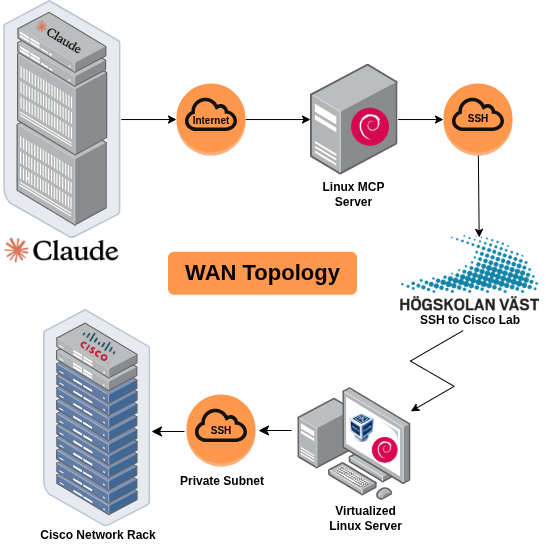
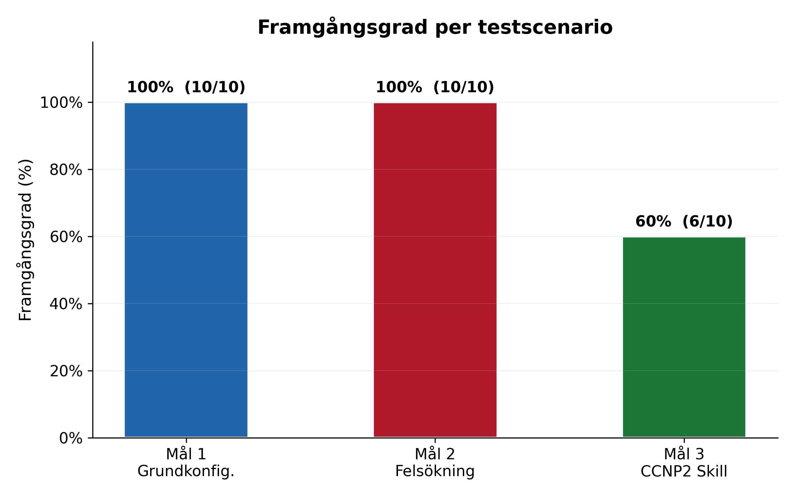
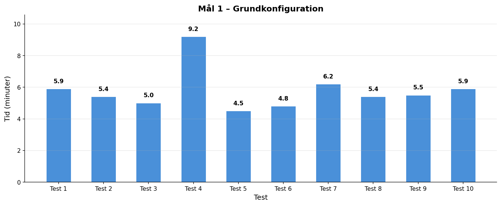
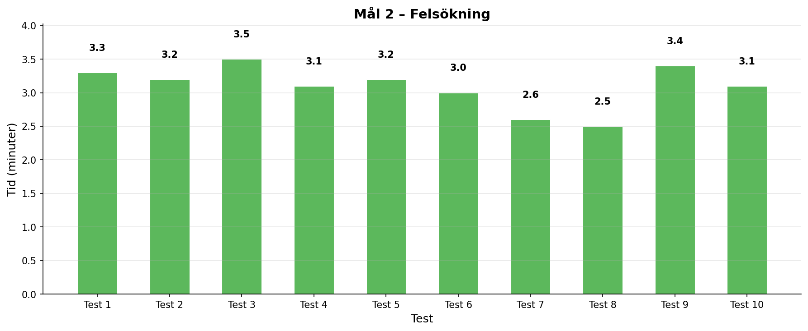
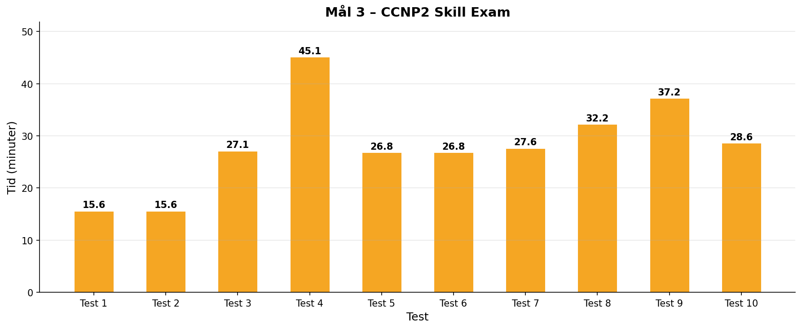
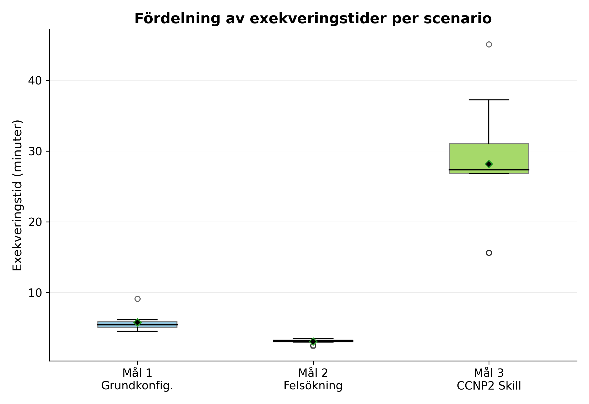

# Generative AI in a Network Environment
## Automation via Model Context Protocol

> **EXN300 Examensarbete** — Högskolan Väst, 2026  
> **Authors:** Tobias Nordström & Marcus Winsnes  
> **Advisor:** Simon Olofsson  
> **Programme:** Network Technology and IT-Security, 120 HE credits

---

## Abstract

This thesis investigates how an AI agent based on a Large Language Model (LLM), using the **Model Context Protocol (MCP)** and simple natural language directives, can configure and administer a network of Cisco equipment. A WAN topology consisting of four nodes was constructed to enable SSH connectivity between the AI agent **Claude** and Cisco network devices in a lab environment at University West.

Four measurable objectives were tested to evaluate the system's reliability and effectiveness:

| # | Objective | Description |
|---|-----------|-------------|
| 1 | **Grundkonfiguration** | Basic CCNA-level configuration (VLAN, trunk, IP, Router-on-a-Stick) |
| 2 | **Felsökning** | Troubleshooting intentionally misconfigured topologies |
| 3 | **CCNP2 Skill Exam** | Full CCNP-level configuration (OSPF, EIGRP, BGP, VRFs, route redistribution) |
| 4 | **USB Autokonfiguration** | Autonomous generation of startup configuration via USB |

---

## Topology

The system uses a relay-based WAN topology enabling Claude to reach Cisco lab equipment at University West from the cloud, traversing four nodes:

**Claude (AWS)** → **Linux MCP Server (Public)** → **Virtualized Linux Server (University West)** → **Cisco Network Rack (Private Subnet)**



---

## Results

### Summary Table

| Objective | Tests | Passed | Success Rate | Mean Time | Min | Max | Std Dev |
|-----------|:-----:|:------:|:------------:|:---------:|:---:|:---:|:-------:|
| Mål 1: Grundkonfiguration | 10 | 10 | **100%** | 5:47 | 4:32 | 9:10 | 1:14 |
| Mål 2: Felsökning | 10 | 10 | **100%** | 3:06 | 2:29 | 3:33 | 0:19 |
| Mål 3: CCNP2 Skill | 10 | 6 | **60%** | 28:16 | 15:38 | 45:04 | 8:23 |
| Mål 4: USB Autoconfig | 1 | 1 | **100%** | N/A | N/A | N/A | N/A |

### Success Rate



CCNA-level tasks (objectives 1 & 2) achieved **100% success rate** across all 20 tests. The CCNP-level configuration dropped to **60%**, with failures caused by token output limits (tests 1–2) and technical configuration errors (tests 5 & 8).

### Execution Times per Objective

#### Mål 1 – Grundkonfiguration


Mean execution time of **5.8 minutes** with high consistency. Test 4 was an outlier at 9.2 minutes — all 10 tests passed.

#### Mål 2 – Felsökning


The fastest objective at **3.1 minutes** mean time with only 19 seconds standard deviation. The agent identified all three intentional errors via a single `show running-config` on each device in every test.

#### Mål 3 – CCNP2 Skill Exam


The most complex objective with significant time variance. Tests 1–2 (15.6 min each) failed due to output token limits. After adding step-based execution in tests 3–10, the token issue was resolved, bringing the adjusted success rate to **75%**.

### Time Distribution (Box Plot)



The box plot illustrates the spread of execution times across all three objectives, clearly showing the increasing variance as task complexity grows.

---

## Key Findings

- **CCNA-level tasks** are fully reliable for AI automation via MCP — 100% success with consistent, fast execution times competitive with human network technicians.
- **CCNP-level tasks** showed 60% reliability, with failures attributed to token limitations and complex inter-VRF routing errors. When given a chance to self-diagnose, the agent could identify its own misconfigurations.
- **Token budget management** is critical — splitting complex tasks into steps with operator confirmation between each step eliminated token-related failures entirely.
- The agent's **approach varied between tests** — sometimes using `expect`, sometimes Python scripts — while its analysis of requirements remained highly consistent.

---

## Technologies

- **AI Agent:** Claude Opus 4.6 (Anthropic)
- **Protocol:** Model Context Protocol (MCP) via custom Node.js server
- **Transport:** Streamable HTTP + nested SSH relay chain
- **Target Devices:** Cisco routers & multilayer switches (IOS)
- **Automation:** sshpass for non-interactive SSH authentication
- **Logging:** Centralized audit trail on mcp-relay (`/mcp/mcp.log`)

---

## Repository Contents

```
├── README.md
├── GOAL-1/
│   ├── LOGS
├── GOAL-2/
│   ├── LOGS
├── GOAL-3/
│   ├── LOGS
├── Images/
│   ├── Topology.png                 # WAN topology diagram
│   ├── diagram_1_framgangsgrad.png  # Success rate chart
│   ├── diagram_3_boxplot.png        # Execution time box plot
│   ├── mål_1.png                    # Mål 1 execution times
│   ├── mål_2.png                    # Mål 2 execution times
│   └── mål_3.png                    # Mål 3 execution times
```

---

## Keywords

`AI` · `Automation` · `Cisco` · `LLM` · `MCP` · `Networks`

---

*Högskolan Väst — Department of Engineering Science, SE-461 86 Trollhättan, Sweden*
